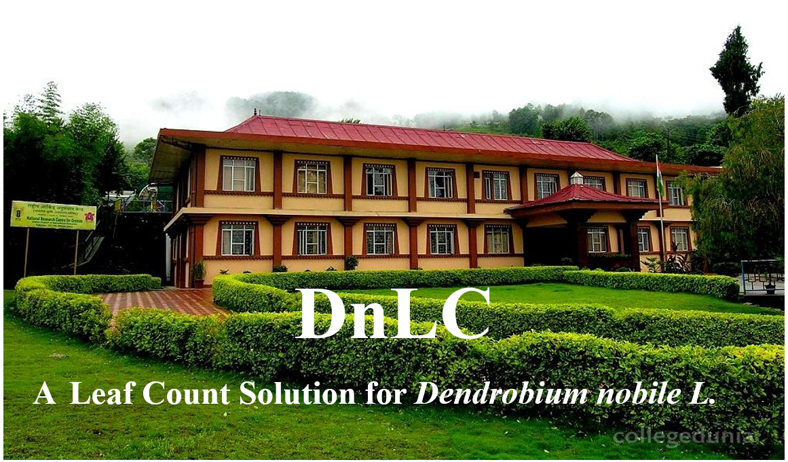

# DnLC: Automated Leaf Counting in *Dendrobium nobile* Using YOLOv5

DnLC is a desktop application for automated detection and counting of leaves in the medicinal orchid *Dendrobium nobile* Lindl. It uses a trained YOLOv5 object-detection model and provides a graphical interface for selecting plant images, producing annotated outputs, and exporting image-wise leaf counts.



## Key features

- Automated detection and counting of *Dendrobium nobile* leaves
- One-class YOLOv5 object detector
- Batch processing of one or more plant images
- Bounding-box and confidence-score visualization
- CSV export of image-wise leaf counts
- Preservation of original image dimensions in saved outputs
- Desktop interface developed with CustomTkinter
- CPU inference support
- Local result browser for previous counting tasks

## Dataset and model performance

The model was developed using 766 plant images containing 10,490 manually annotated leaf bounding boxes.

| Metric | Value |
|---|---:|
| F1-score | 0.750 |
| mAP@0.50 | 0.753 |

These values correspond to the dataset and evaluation protocol reported in the associated study. Performance may vary with illumination, image resolution, camera distance, background complexity, plant developmental stage, and leaf overlap.

## Repository structure

```text
DnLC/
├── DnLC.py
├── Leaf_count.pt
├── requirements.txt
├── README.md
├── LICENSE
├── CITATION.cff
├── CHANGELOG.md
├── ASSET_NOTICES.md
├── THIRD_PARTY_NOTICES.md
├── YOLOV5_VERSION.txt
├── Screen.png
├── icar_logo.png
├── iasri_logo.png
├── orchid_logo.png
└── yolov5/
    ├── models/
    ├── utils/
    ├── data/
    ├── detect.py
    ├── requirements.txt
    └── LICENSE
```

The pinned YOLOv5 source corresponds to commit:

```text
46d9a3c48ee08c5d2c9cb1a827d5462d1b24527c
```

See `YOLOV5_VERSION.txt` and `THIRD_PARTY_NOTICES.md` for details.

## System requirements

- Windows, macOS, or Linux
- Python 3.10 or later recommended
- 8 GB RAM recommended
- CPU inference supported
- NVIDIA GPU optional

The clean-clone release test was completed on macOS using Python 3.13.0, PyTorch 2.6.0, and CPU inference.

## Installation

Clone the repository:

```bash
git clone https://github.com/ChandanIasri/DnLC.git
cd DnLC
```

Create a virtual environment:

```bash
python3 -m venv dnlc_env
```

Activate it on macOS or Linux:

```bash
source dnlc_env/bin/activate
```

Activate it on Windows:

```powershell
dnlc_env\Scripts\activate
```

Install the required packages:

```bash
python -m pip install --upgrade pip
pip install -r requirements.txt
```

The pinned YOLOv5 source requires `pkg_resources`; therefore, the environment uses:

```text
setuptools<81
```

Tkinter is included in standard Python distributions on Windows and macOS. On Ubuntu or Debian, it may need to be installed separately:

```bash
sudo apt-get install python3-tk
```

## Running DnLC

From the repository root:

```bash
python DnLC.py
```

Workflow:

1. Open **Leaf Count**.
2. Select one or more *Dendrobium nobile* plant images.
3. Click **Count Leaves**.
4. Review the image-wise count in the completion dialog.
5. Open **Old Count** to inspect saved annotated images and CSV files.

Every task creates a directory such as:

```text
Counts/
└── Count_YYYYMMDD_HHMMSS/
    ├── basic_info.txt
    ├── leaf_count_results.csv
    └── image_name_counted.png
```

## Inference configuration

| Parameter | Value |
|---|---:|
| Confidence threshold | 0.65 |
| IoU threshold | 0.45 |
| Inference image size | 640 |
| Target class | Leaf |
| Maximum detections per image | 1000 |

These settings are recorded in each task's `basic_info.txt` file.

The confidence threshold of 0.65 was retained for the released application after testing the trained model on the reference image used during release validation. Users applying DnLC under substantially different imaging conditions should independently validate the operating threshold.

## Recommended image-acquisition conditions

- Capture the complete plant within the image frame.
- Use a plain or minimally complex background.
- Avoid severe shadows and overexposure.
- Maintain a consistent camera-to-plant distance.
- Minimize motion blur.
- Keep the plant approximately perpendicular to the camera.
- Use sufficient image resolution.
- Avoid unrelated plants or leaf-like objects in the frame.

## Limitations

- Heavy leaf overlap or occlusion can reduce detection accuracy.
- Very small, folded, blurred, damaged, or partially visible leaves may be missed.
- Background objects resembling leaves may generate false-positive detections.
- Performance can decline under imaging conditions unlike those used for model development.
- The model was developed specifically for *Dendrobium nobile* and should not be assumed to generalize to other plant species.
- Automated counts should be independently validated before use in critical breeding, physiological, or commercial decisions.

## Data availability

The original image dataset is available from the corresponding author upon reasonable request, subject to applicable institutional policies and data-sharing restrictions.

## Code availability

The source code, pinned YOLOv5 source, trained model weights, and graphical-interface files are available in this repository:

```text
https://github.com/ChandanIasri/DnLC
```

The first archived software release will be deposited through the GitHub–Zenodo integration as version `v1.0.0`. The DOI will be added after Zenodo processes the release.

## Citation

Citation metadata are provided in `CITATION.cff`.

The associated manuscript is currently under review:

> Deep Learning-based application for automated leaf counting in medicinal orchid *Dendrobium nobile* L. using YOLOv5.

After publication, the final journal citation and article DOI should be added here.

## Licence

The DnLC source code is distributed under the GNU General Public License v3.0. See `LICENSE`.

The incorporated YOLOv5 source remains subject to the licence included in `yolov5/LICENSE`. See `THIRD_PARTY_NOTICES.md`.

Institutional logos and other visual assets may have separate ownership or usage restrictions and are not automatically relicensed under GPL-3.0. See `ASSET_NOTICES.md`.

## Authors and contact

**Dr. Chandan Kumar Deb**  
Division of Computer Applications  
ICAR–Indian Agricultural Statistics Research Institute  
New Delhi, India  
Email: chandan.deb@icar.gov.in  
GitHub: ChandanIasri

## Disclaimer

DnLC is research software. Predictions may contain false-positive or false-negative detections. Users should apply appropriate scientific validation and expert interpretation.
